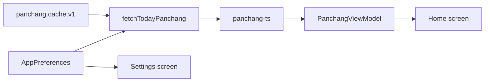

# Panchang data flow

How offline daily Panchang is computed, cached, and displayed in the app.

## Overview

## Preferences

Stored in `@capacitor/preferences` under `app.preferences.v2`:

| Field | Values | Default |
|-------|--------|---------|
| `language` | `en`, `hi`, `sa`, `te`, `ta` | `en` |
| `masaSystem` | `auto`, `amanta`, `purnimanta` | `auto` |
| `location` | lat/lon, timezone, label, source | New Delhi |
| `locationAutoDetected` | boolean | `false` |

Sanskrit labels are applied post-hoc via `src/lib/i18n/terms.ts`; `panchang-ts` receives `en` or `hi` only.

## Location sources

| Source | How set | Notes |
|--------|---------|-------|
| `city` | User picks from preset list | 12 Indian metros |
| `approx` | Auto on first launch via IP geolocation | India → nearest preset city; abroad → IP coords + city label |
| `gps` | User taps "Use current location" | Requires permission; uses device IANA timezone |

## Computation

[`src/lib/panchang/service.ts`](../../src/lib/panchang/service.ts):

1. `getDailyPanchang` — sunrise-to-sunrise Hindu day (tithi, maasa, samvat)
2. `getInstantPanchang` — current tithi progress for moon disc
3. `getSamvatsaraName` — 60-year name from Vikram Samvat year

Location from preset city, approximate IP geolocation (first launch), or GPS (`@capacitor/geolocation`). Approximate and GPS paths use the device IANA timezone when not mapped to a preset city.

When `masaSystem` is `auto`, the effective system is resolved from location in [`src/lib/panchang/masa-system.ts`](../../src/lib/panchang/masa-system.ts): preset and approx-mapped cities carry regional metadata; GPS uses the nearest preset city within 50 km, otherwise a latitude/longitude heuristic (South/West India → amanta, North/East → purnimanta).

## Cache

Per [ADR-002](../02-decisions/adr-002-offline-panchang.md), daily results are cached in Preferences under `panchang.cache.v1`. Invalidated when `now >= nextSunrise` or when location/language/masa preferences change (cache key mismatch).

## Key paths

| Path | Role |
|------|------|
| `src/lib/geo.ts` | Haversine distance, India bounds, nearest preset city |
| `src/lib/approximate-location.ts` | IP geolocation → StoredLocation on first launch |
| `src/lib/panchang/masa-system.ts` | Location-based amanta/purnimanta resolution |
| `src/lib/panchang/service.ts` | Panchang computation |
| `src/lib/panchang/cache.ts` | Sunrise-based cache |
| `src/lib/preferences.ts` | Settings persistence |
| `src/contexts/AppPreferencesContext.tsx` | React preferences state |
| `src/hooks/usePanchangToday.ts` | Home screen data hook |
